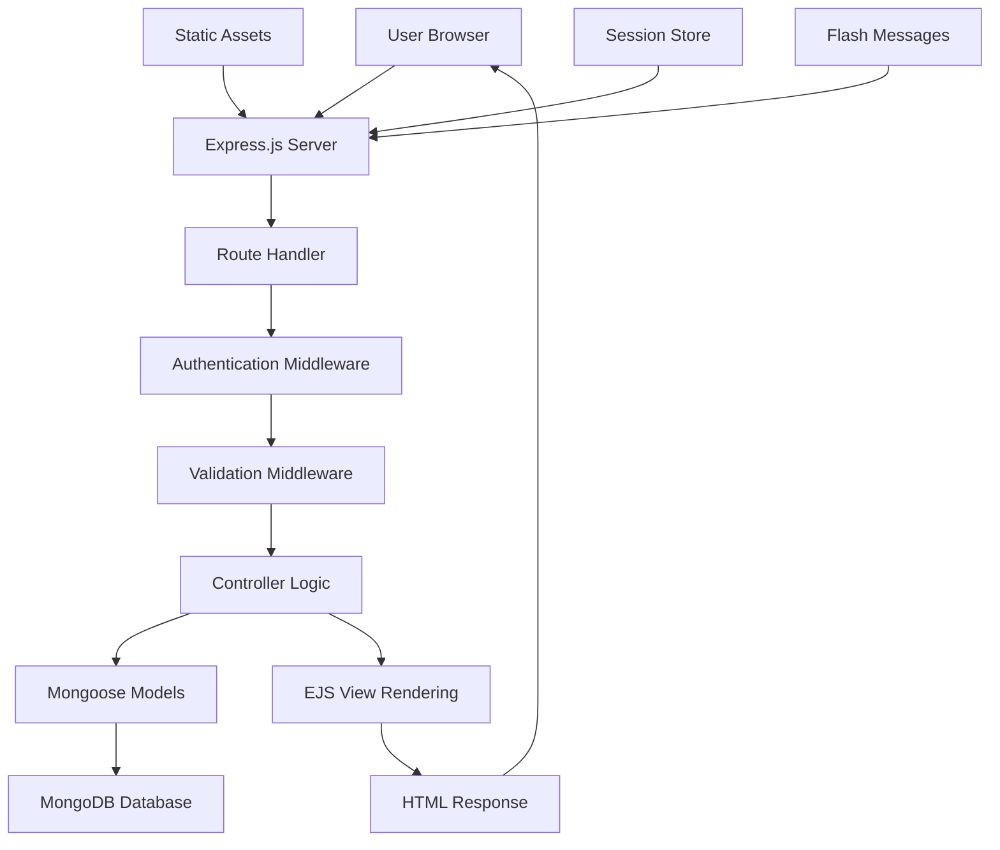
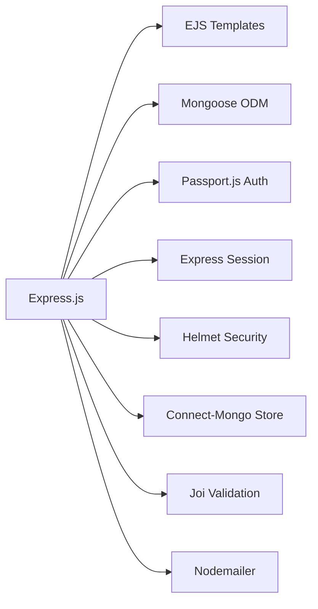
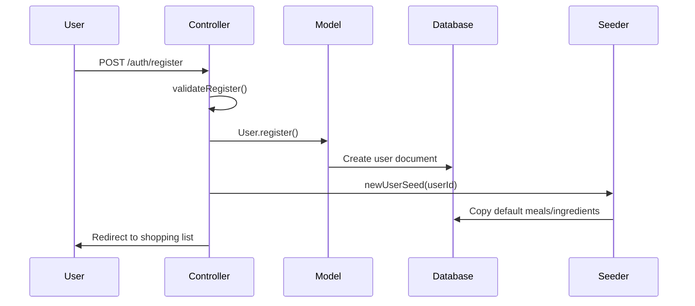
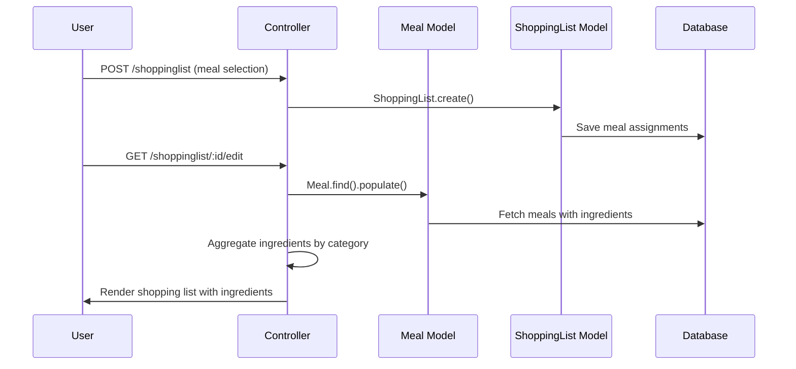
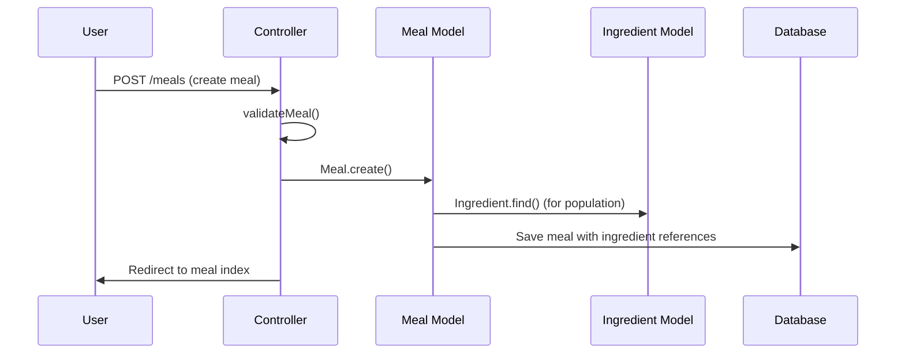

# ARCHITECTURE_REFERENCE.md

## System Overview

**SLAPP** (Shopping List Application) is a web-based meal planning and shopping list management system built with Node.js and Express. The application allows users to:

- Create and manage meals with ingredients and recipes
- Plan weekly meals across different meal types (breakfast, lunch, dinner)
- Generate shopping lists automatically from meal plans
- Organize shopping items by customizable categories
- Manage user accounts with authentication and password reset

### Core Features

- User authentication (register, login, logout, password reset)
- Meal management with ingredient associations
- Weekly meal planning
- Automatic shopping list generation
- Category customization for shopping items
- Data seeding for new users from default templates

## Architecture Flow



### Request Flow

1. **Incoming Request** → Express.js receives HTTP request
2. **Security Middleware** → Helmet, MongoDB sanitization, compression
3. **Session/Authentication** → Passport.js authentication check
4. **Route Matching** → Express router matches URL pattern
5. **Middleware Chain** → Validation, authorization, logging
6. **Controller Execution** → Business logic implementation
7. **Database Operations** → Mongoose ODM interactions
8. **View Rendering** → EJS template compilation
9. **Response** → HTML/JSON response to client

## File/Module Inventory

### Core Application Files

#### `app.js` - Main Application Entry Point

- **Purpose**: Express application setup and configuration
- **Responsibilities**:
  - Database connection (MongoDB via Mongoose)
  - Middleware configuration (security, session, authentication)
  - Route registration for all controllers
  - Error handling setup
- **Key Functions**: Server initialization, middleware stack setup

### Models Layer (`models/`)

#### `models/user.js` - User Authentication Model

- **Purpose**: User account management and authentication
- **Key Exports**: User model with passport-local-mongoose integration
- **Schema Fields**: email, username, password (handled by plugin), reset tokens

#### `models/meal.js` - Meal Definition Model

- **Purpose**: Meal definitions with ingredients and scheduling
- **Key Exports**: Meal model, mealType enum, defaults array
- **Schema Fields**:
  - mealName, mealRecipe, mealType
  - weeklyItems (ingredients with quantities)
  - replaceOnUse (consumable ingredients)
  - default (weekly schedule assignments)
  - author (user ownership)

#### `models/ingredient.js` - Ingredient Management Model

- **Purpose**: Individual ingredient definitions with categorization
- **Key Exports**: Ingredient model
- **Schema Fields**: name, cat (category), author

#### `models/shoppingList.js` - Shopping List Model

- **Purpose**: Weekly shopping list generation and management
- **Key Exports**: ShoppingList model
- **Schema Fields**:
  - Daily meal assignments (friday, saturday, etc.)
  - items array, editVer object
  - author, timestamps

#### `models/category.js` - Category Customization Model

- **Purpose**: User-specific shopping categories
- **Key Exports**: Category model
- **Schema Fields**: catList (array of category names), author

#### `models/schemas.js` - Validation Schemas

- **Purpose**: Joi validation schemas for all user inputs
- **Key Exports**: Validation schemas for all forms
- **Features**: HTML sanitization, custom validation rules

### Controllers Layer (`controllers/`)

#### `controllers/users.js` - User Management Controller

- **Purpose**: User authentication and account management
- **Key Functions**: register, login, logout, password reset, account details
- **Features**: Email notifications, user seeding on registration

#### `controllers/meals.js` - Meal Management Controller

- **Purpose**: CRUD operations for meals and ingredients
- **Key Functions**: index, new, create, show, edit, update, delete
- **Features**: Ingredient population, category integration

#### `controllers/shoppingLists.js` - Shopping List Controller

- **Purpose**: Shopping list creation and management
- **Key Functions**: landing, index, newMeals, createMeals, show, edit
- **Features**: Automatic list generation from meal plans

#### `controllers/ingredients.js` - Ingredient Management Controller

- **Purpose**: Ingredient CRUD operations
- **Key Functions**: index, edit, update, delete
- **Features**: Category-based organization

#### `controllers/categories.js` - Category Management Controller

- **Purpose**: Category customization
- **Key Functions**: indexCustomise, updateCustomise

#### `controllers/policy.js` - Policy and Legal Controller

- **Purpose**: Legal pages and system information
- **Key Functions**: cookiePolicy, tandc, logs

### Utilities Layer (`utils/`)

#### `utils/middleware.js` - Custom Middleware

- **Purpose**: Authentication, authorization, and validation middleware
- **Key Functions**:
  - Validation functions for all forms
  - Authorization checks (isLoggedIn, isAuthor\*)
  - JoiFlashError for user-friendly error messages

#### `utils/catchAsync.js` - Async Error Wrapper

- **Purpose**: Eliminates try-catch blocks in async route handlers
- **Key Functions**: Wrapper function for async error handling

#### `utils/ExpressError.js` - Custom Error Class

- **Purpose**: Enhanced error handling with status codes
- **Key Functions**: Error class with message and statusCode

#### `utils/errorHandler.js` - Centralized Error Handler

- **Purpose**: Global error processing and user feedback
- **Key Functions**: Error type detection, flash messages, error rendering

#### `utils/newUserSeed.js` - User Data Seeding

- **Purpose**: Initialize new users with default meals and ingredients
- **Key Functions**: newUserSeed - copies from default user template

#### `utils/mail.js` - Email Service

- **Purpose**: Email notifications for user actions
- **Key Functions**: mail - sends emails via nodemailer

#### `utils/logger.js` - Request Logging

- **Purpose**: HTTP request logging for monitoring
- **Key Functions**: Request logging middleware

#### `utils/toUpperCase.js` - String Utility

- **Purpose**: String case conversion utilities
- **Key Functions**: Text transformation helpers

### Views Layer (`views/`)

#### `views/layouts/boilerplate.ejs` - Main Layout Template

- **Purpose**: Base HTML structure for all pages
- **Features**: Meta tags, CSS/JS includes, flash messages, navigation

#### View Categories:

- `views/meals/` - Meal management pages
- `views/ingredients/` - Ingredient management pages
- `views/shoppinglist/` - Shopping list pages
- `views/users/auth/` - Authentication pages
- `views/partials/` - Reusable components
- `views/policy/` - Legal pages

### Static Assets (`public/`)

#### `public/javascripts/` - Client-side Scripts

- **Purpose**: Frontend interactivity and form validation
- **Key Files**:
  - `validateForms.js` - Form validation
  - `meals*.js` - Meal management functionality
  - `sl*.js` - Shopping list functionality
  - `authRegister.js` - Authentication forms

#### `public/stylesheets/` - CSS Stylesheets

- **Purpose**: Styling for all application pages
- **Organization**: One CSS file per view category

#### `public/images/` - Static Images

- **Purpose**: Application images and backgrounds

## Dependency Map

### Core Dependencies

#### External Dependencies (package.json)



#### Internal Module Dependencies

**app.js** (Entry Point)

```
├── controllers/
│   ├── users.js
│   ├── meals.js
│   ├── ingredients.js
│   ├── shoppingLists.js
│   ├── categories.js
│   └── policy.js
├── models/
│   ├── user.js
│   ├── meal.js
│   ├── ingredient.js
│   ├── shoppingList.js
│   └── category.js
└── utils/
    ├── middleware.js
    ├── catchAsync.js
    ├── ExpressError.js
    ├── errorHandler.js
    └── logger.js
```

**Controller Dependencies**

```
controllers/users.js
├── models/user.js
├── models/meal.js
├── models/ingredient.js
├── models/shoppingList.js
├── models/category.js
├── utils/catchAsync.js
├── utils/mail.js
└── utils/newUserSeed.js

controllers/meals.js
├── models/meal.js
├── models/ingredient.js
├── models/category.js
└── utils/toUpperCase.js

controllers/shoppingLists.js
├── models/meal.js
├── models/shoppingList.js
├── models/category.js
└── utils/copyToClip.js
```

**Model Dependencies**

```
models/user.js
├── mongoose
└── passport-local-mongoose

models/meal.js
└── mongoose

models/ingredient.js
└── mongoose

models/shoppingList.js
└── mongoose

models/category.js
└── mongoose

models/schemas.js
├── joi
└── sanitize-html
```

### Entry Points

- **Primary**: `app.js` - Express application setup
- **Database**: MongoDB connection via Mongoose
- **Authentication**: Passport.js with Local Strategy
- **Templates**: EJS rendering engine

### Circular Dependencies

- **None detected** - Clean separation of concerns maintained

## Data Flow

### User Registration Flow



### Shopping List Generation Flow



### Meal Management Flow



## Key Interactions

### Authentication Flow

1. **Login**: `users.js:loginPost` → Passport authentication → Session creation
2. **Authorization**: `middleware.js:isLoggedIn` → User session check
3. **Resource Ownership**: `middleware.js:isAuthor*` → Author field validation

### Meal Planning Interaction

1. **Meal Creation**: `meals.js:create` → Ingredient population → Category assignment
2. **Weekly Assignment**: `shoppingLists.js:createMeals` → Meal selection → Schedule mapping
3. **List Generation**: `shoppingLists.js:createIngredients` → Ingredient aggregation → Category grouping

### Data Seeding Interaction

1. **New User Registration**: `users.js:registerPost` → `newUserSeed.js:newUserSeed`
2. **Template Copying**: Default user data → New user account with same meals/ingredients
3. **Category Initialization**: Standard categories → User-specific category list

### Validation Chain

1. **Input Validation**: `middleware.js:validate*` → Joi schema validation
2. **Sanitization**: `schemas.js:escapeHTML` → HTML tag removal
3. **Error Handling**: `catchAsync.js` → `errorHandler.js` → User-friendly messages

## Extension Points

### Adding New Features

#### New Model Types

1. **Create Model**: Add to `models/` directory
2. **Define Schema**: Follow existing patterns with author field
3. **Add Validation**: Create schema in `models/schemas.js`
4. **Update Middleware**: Add validation and authorization functions

#### New Controllers

1. **Create Controller**: Add to `controllers/` directory
2. **Follow Pattern**: Use catchAsync wrapper and error handling
3. **Add Routes**: Register in `app.js` with middleware chain
4. **Create Views**: Add EJS templates in `views/` directory

#### Frontend Extensions

1. **JavaScript Modules**: Add to `public/javascripts/`
2. **CSS Styles**: Add to `public/stylesheets/`
3. **View Components**: Create partials in `views/partials/`

### Database Schema Extensions

1. **New Fields**: Add to existing schemas in `models/`
2. **Relationships**: Use ObjectId references with population
3. **Enums**: Define arrays for constrained values
4. **Indexes**: Add for performance optimization

### API Extensions

1. **REST Endpoints**: Follow RESTful conventions in controllers
2. **Middleware**: Add validation and authorization as needed
3. **Error Handling**: Leverage existing error infrastructure
4. **Response Format**: Maintain consistent JSON/HTML responses

### Integration Points

1. **Authentication**: Extend Passport strategies for OAuth, etc.
2. **Email**: Enhance `utils/mail.js` for templates, attachments
3. **File Upload**: Add multer middleware for image uploads
4. **External APIs**: Add service layer in `utils/` directory

### Configuration Extensions

1. **Environment Variables**: Add to `.env` file and `app.js` configuration
2. **Database**: Support multiple databases or read replicas
3. **Security**: Enhance Helmet configuration for new requirements
4. **Performance**: Add caching layers or CDN integration

This architecture provides a solid foundation for extending the shopping list application with new features while maintaining clean separation of concerns and consistent patterns throughout the codebase.
