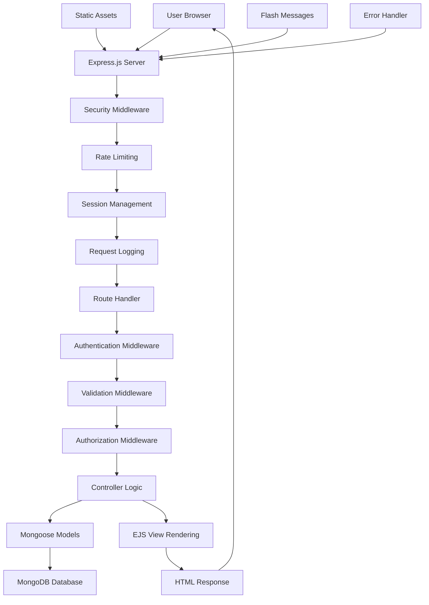
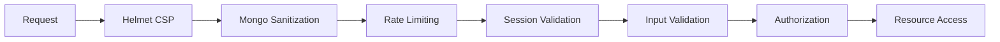
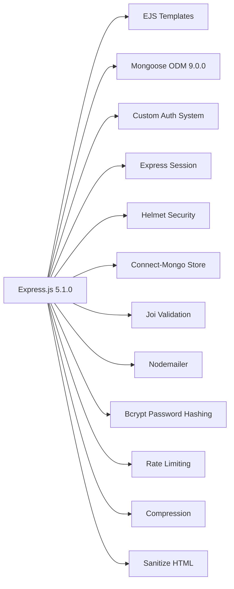
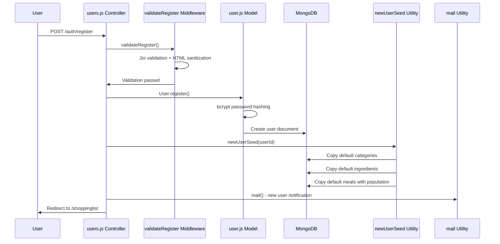
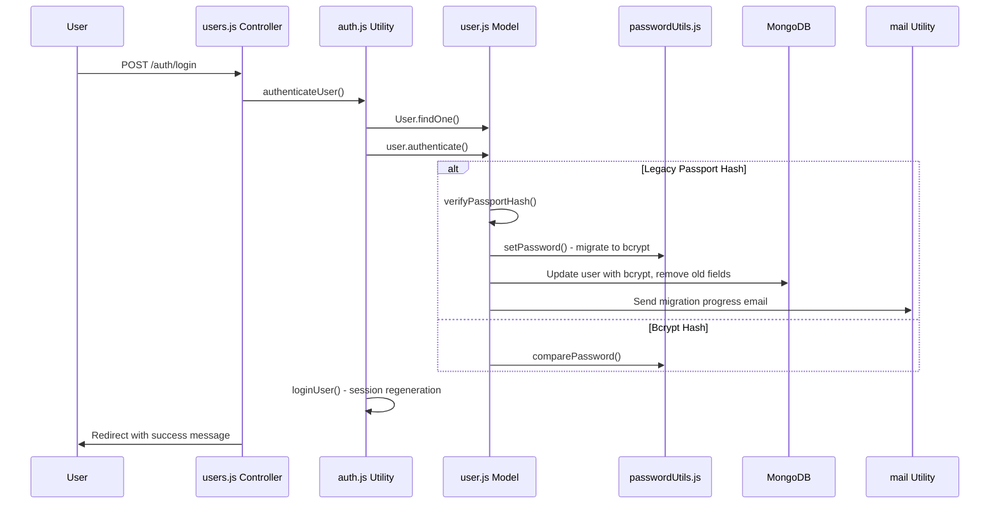
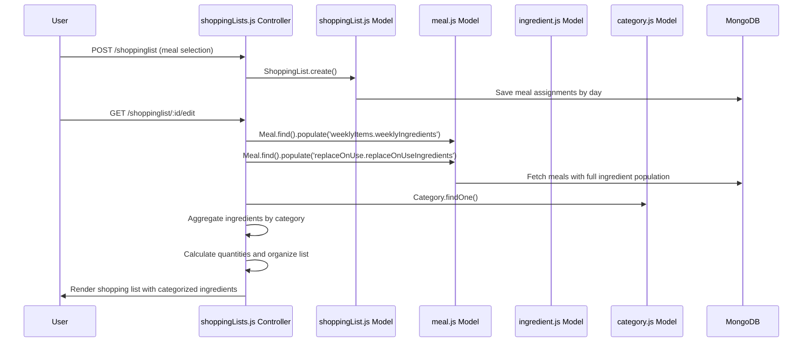
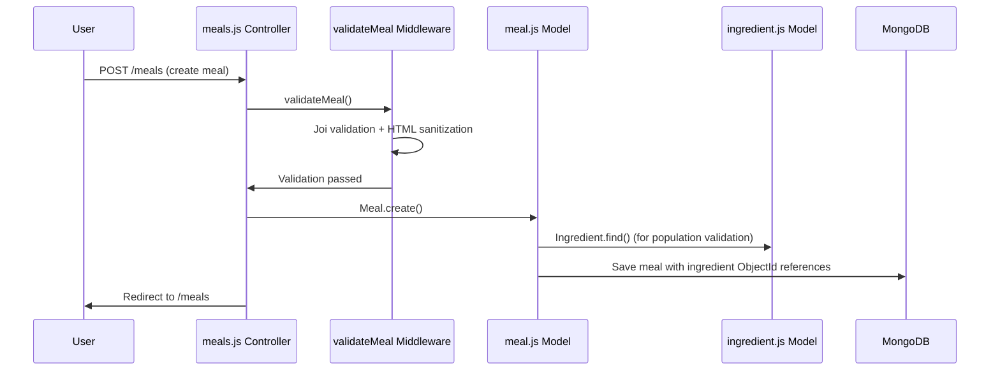
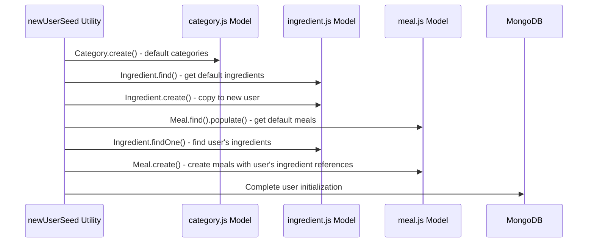

# ARCHITECTURE_REFERENCE.md

## System Overview

**SLAPP** (Shopping List Application) is a comprehensive web-based meal planning and shopping list management system built with Node.js, Express.js, and MongoDB. The application provides a complete solution for users to:

- Create and manage meals with detailed ingredients and recipes
- Plan weekly meals across different meal types (Breakfast, Lunch, Main, Constant Weekly Items, Nonfood Items)
- Generate shopping lists automatically from weekly meal plans
- Organize shopping items by fully customizable categories
- Manage user accounts with secure authentication and password reset functionality
- Track user activity and system logs for monitoring

### Core Features

- **User Management**: Registration, login, logout, password reset, account details, account deletion
- **Meal Management**: CRUD operations for meals with ingredient population and categorization
- **Ingredient Management**: Centralized ingredient database with category assignments
- **Shopping List Generation**: Automatic list creation from meal plans with ingredient aggregation
- **Category Customization**: User-specific shopping categories for organization
- **Data Seeding**: Automatic initialization of new users with default meals and ingredients
- **Security**: Rate limiting, input sanitization, CSRF protection, secure sessions
- **Logging**: Request tracking and user activity monitoring

### Technology Stack

- **Backend**: Node.js, Express.js 5.1.0
- **Database**: MongoDB with Mongoose ODM 9.0.0 (MongoDB Atlas cloud hosting)
- **Authentication**: Custom bcrypt-based authentication with passport-local-mongoose migration support
- **Templating**: EJS with ejs-mate for layouts
- **Security**: Helmet 8.1.0, express-mongo-sanitize, express-rate-limit 8.2.1
- **Session Management**: express-session with connect-mongo store
- **Validation**: Joi 18.0.1 with sanitize-html 2.17.0 for HTML sanitization
- **Email**: Nodemailer 7.0.9 for notifications
- **Frontend**: Vanilla JavaScript, Bootstrap CSS
- **Additional**: Compression middleware, method-override, express-back, reCAPTCHA integration

## Architecture Flow



### Detailed Request Flow

1. **Incoming Request** → Express.js receives HTTP request
2. **Security Layer** → Helmet CSP configuration (environment-specific), compression, favicon handling
3. **Rate Limiting** → Authentication endpoints protected (15min/10 attempts for auth, 1hr/5 attempts for password reset)
4. **Session Management** → MongoDB-backed session store with secure cookies (14-day expiry, httpOnly, SameSite: strict)
5. **Request Logging** → Custom logger middleware tracks all requests with geographic data
6. **Route Matching** → Express router matches URL pattern
7. **Authentication Check** → Custom auth middleware verifies user session with userId validation
8. **Input Validation** → Joi schemas validate and sanitize all inputs (HTML tag removal)
9. **Authorization** → Resource ownership verification (isAuthor\* middleware with deep population)
10. **Controller Execution** → Business logic wrapped in catchAsync for consistent error handling
11. **Database Operations** → Mongoose ODM with proper error handling and population strategies
12. **View Rendering** → EJS templates with flash messages and user context
13. **Response** → HTML/JSON response with proper headers
14. **Error Handling** → Centralized error handler for consistent error responses

### Security Flow



### Security Configuration Details

#### Helmet CSP Configuration
- **Production**: Strict CSP with allowed domains for Bootstrap, jQuery, Google Fonts, reCAPTCHA
- **Development**: Relaxed CSP with wildcard allowances for easier debugging
- **Features**: Content Security Policy, Cross-Origin Opener Policy, Origin Agent Cluster

#### Session Security
- **Cookie Name**: "slapp"
- **Duration**: 14 days (1000 * 60 * 60 * 24 * 7 * 2 milliseconds)
- **Security Flags**: httpOnly, SameSite: strict, secure (production only)
- **Storage**: MongoDB via connect-mongo for persistence across server restarts

#### Rate Limiting Configuration
- **Authentication Endpoints**: 10 requests per 15 minutes per IP
- **Password Reset**: 5 requests per hour per IP
- **Features**: Standard headers enabled, legacy headers disabled

#### Input Sanitization
- **MongoDB Injection Protection**: express-mongo-sanitize with underscore replacement
- **XSS Protection**: Custom Joi extension with sanitize-html (no allowed tags)
- **HTML Escaping**: All string inputs validated for HTML tag removal

## File/Module Inventory

### Core Application Files

#### `app.js` - Main Application Entry Point

- **Purpose**: Express application setup and configuration
- **Responsibilities**:
  - Database connection (MongoDB via Mongoose with Atlas integration)
  - Comprehensive middleware configuration (security, session, authentication)
  - Route registration for all controllers with proper middleware chains
  - Environment-based configuration (development vs production)
  - Error handling setup and 404 handling
- **Key Functions**: Server initialization on port 3001, middleware stack setup
- **Security Features**: Helmet CSP configuration, rate limiting, MongoDB sanitization

### Models Layer (`models/`)

#### `models/user.js` - User Authentication Model

- **Purpose**: User account management with custom authentication system
- **Key Exports**: User model with bcrypt password hashing
- **Schema Fields**:
  - username, email (unique, required)
  - password (bcrypt hash, select: false for security)
  - hash, salt (legacy passport fields for migration, select: false)
  - resetPasswordToken, resetPasswordExpires
- **Special Features**:
  - Password migration from passport-local-mongoose to bcrypt with PBKDF2 verification
  - Custom authentication method supporting both legacy and bcrypt formats
  - Automatic migration with transaction safety and progress email notifications
  - Static register() method for new user creation
  - Instance authenticate() and setPassword() methods
- **Migration Logic**: Detects passport-local-mongoose hashes (1024-char hex + 64-char hex salt) and converts to bcrypt on successful login

#### `models/meal.js` - Meal Definition Model

- **Purpose**: Meal definitions with ingredients, recipes, and scheduling
- **Key Exports**: Meal model, mealType enum, defaults array
- **Schema Fields**:
  - mealName, mealRecipe, mealType (enum: Breakfast, Lunch, Main, Constant Weekly Items, Nonfood Items, Archive)
  - weeklyItems (array of {qty, weeklyIngredients: ObjectId ref to Ingredient})
  - replaceOnUse (array of {qty, replaceOnUseIngredients: ObjectId ref to Ingredient})
  - default (array of weekly schedule assignments: friday, saturday, sunday, monday, tuesday, wednesday, thursday, lunchWeekday, lunchWeekend, breakfast, none, unAssig)
  - author (user ownership reference)
- **Relationships**: References Ingredient model via ObjectId with population support
- **Enums**: mealType (6 types), defaults (12 schedule options)

#### `models/ingredient.js` - Ingredient Management Model

- **Purpose**: Individual ingredient definitions with categorization
- **Key Exports**: Ingredient model
- **Schema Fields**: name (required), cat (category, required), author (user reference)
- **Usage**: Referenced by Meal model for ingredient population

#### `models/shoppingList.js` - Shopping List Model

- **Purpose**: Weekly shopping list generation and management
- **Key Exports**: ShoppingList model
- **Schema Fields**:
  - name (required), timestamps (automatic createdAt, updatedAt)
  - Daily meal assignments (friday, saturday, sunday, monday, tuesday, wednesday, thursday)
  - Special meals: lunchWeekday, lunchWeekend, breakfast
  - items array (dynamic storage for generated shopping list items)
  - editVer object (version tracking for collaborative editing)
  - author (user ownership reference)
- **Relationships**: All meal fields reference Meal model via ObjectId for population
- **Features**: Automatic timestamp tracking, version control support

#### `models/category.js` - Category Customization Model

- **Purpose**: User-specific shopping categories
- **Key Exports**: Category model
- **Schema Fields**: catList (array of category names), author (user reference)
- **Default Categories**: Toiletries, Veg 1, Veg 2, Veg 3, Veg 4, Meat And dairy, Beans And Spices, Middle store, Milk And bread, Frozen, Non food
- **Usage**: Referenced by shopping list generation for ingredient organization

#### `models/schemas.js` - Validation Schemas

- **Purpose**: Joi validation schemas for all user inputs with HTML sanitization
- **Key Exports**: Validation schemas for all forms
- **Features**:
  - Custom HTML escape extension using sanitize-html (no allowed tags/attributes)
  - Comprehensive validation for all user inputs with environment-specific error handling
  - Extended Joi with string.escapeHTML() method for XSS prevention
- **Schemas Included**: registerSchema, loginSchema, mealSchema, ingredientSchema, shoppingListMealsSchema, shoppingListIngredientsSchema, defaultSchema, categorySchema, tandcSchema, forgotSchema, resetSchema, detailsSchema, deleteSchema
- **Security**: All string inputs automatically sanitized for HTML tags

#### `models/Log.js` - System Logging Model

- **Purpose**: Request tracking and user activity monitoring with geographic data
- **Key Exports**: Log model
- **Schema Fields**:
  - ip (required, unique), country, city (from micro-geoip-lite)
  - timesVisited, lastVisitDate, lastVisitTime
  - routes (Map of route visit counts for analytics)
- **Integration**: Used by utils/logger.js for comprehensive request tracking

### Controllers Layer (`controllers/`)

#### `controllers/users.js` - User Management Controller

- **Purpose**: Complete user authentication and account management
- **Key Functions**: register, registerPost, login, logout, forgot, forgotPost, reset, resetPost, details, detailsPost, deletePre, delete
- **Features**:
  - Email notifications for new registrations and password resets
  - Automatic user seeding with default data on registration
  - Account deletion with confirmation
  - Terms and conditions validation
  - Rate limiting on authentication endpoints

#### `controllers/meals.js` - Meal Management Controller

- **Purpose**: Complete CRUD operations for meals with ingredient management
- **Key Functions**: index, new, create, show, edit, update, delete
- **Features**:
  - Ingredient population from ObjectId references
  - Category integration for ingredient organization
  - Recipe storage and display
  - Meal type categorization
  - Author-based access control

#### `controllers/shoppingLists.js` - Shopping List Controller

- **Purpose**: Shopping list creation, management, and generation
- **Key Functions**: landing, index, newMeals, createMeals, defaultGet, defaultPatch, edit, createIngredients, show, delete
- **Features**:
  - Automatic list generation from meal plans
  - Ingredient aggregation by category
  - Weekly meal assignment management
  - Default meal schedule configuration
  - Edit version tracking for collaborative features

#### `controllers/ingredients.js` - Ingredient Management Controller

- **Purpose**: Ingredient CRUD operations with category management
- **Key Functions**: index, edit, update, delete
- **Features**:
  - Category-based organization
  - Bulk ingredient management
  - Author-based access control
  - Integration with meal ingredient population

#### `controllers/categories.js` - Category Management Controller

- **Purpose**: User-specific category customization
- **Key Functions**: indexCustomise, updateCustomise
- **Features**:
  - Dynamic category list management
  - User-specific category sets
  - Integration with shopping list organization

#### `controllers/policy.js` - Policy and Legal Controller

- **Purpose**: Legal pages and system information display
- **Key Functions**: cookiePolicy, tandc, tandcPost, logs
- **Features**:
  - Cookie policy compliance
  - Terms and conditions with reCAPTCHA validation
  - System logs display for monitoring
  - Legal compliance features

### Utilities Layer (`utils/`)

#### `utils/middleware.js` - Custom Middleware

- **Purpose**: Authentication, authorization, and validation middleware
- **Key Functions**:
  - Validation functions for all forms (validateRegister, validateMeal, validateIngredient, etc.)
  - Authorization checks (isLoggedIn, isAuthorMeal, isAuthorIngredient, isAuthorShoppingList)
  - JoiFlashError for user-friendly error messages with environment-specific handling
- **Features**: HTML sanitization, custom validation rules, flash message integration
- **Security**: Session validation with userId matching, resource ownership verification
- **Population**: Author middleware includes deep population for complex relationships (weeklyItems.weeklyIngredients, replaceOnUse.replaceOnUseIngredients)

#### `utils/catchAsync.js` - Async Error Wrapper

- **Purpose**: Eliminates try-catch blocks in async route handlers
- **Key Functions**: Wrapper function that catches errors and passes to next()
- **Usage**: Applied to all async route handlers for consistent error handling

#### `utils/ExpressError.js` - Custom Error Class

- **Purpose**: Enhanced error handling with status codes
- **Key Functions**: Error class with message and statusCode properties
- **Features**: Standardized error format across the application

#### `utils/errorHandler.js` - Centralized Error Handler

- **Purpose**: Global error processing and user feedback
- **Key Functions**: Error type detection, flash messages, error rendering
- **Features**: Development vs production error handling, logging, user-friendly messages

#### `utils/auth.js` - Custom Authentication System

- **Purpose**: Custom authentication replacing passport-local-mongoose
- **Key Functions**: authenticateUser, loginUser, logoutUser
- **Features**:
  - Session management with regeneration for security (prevents session fixation)
  - Support for password migration from legacy system
  - Custom error handling with environment-specific messages
  - Promise-based API for async/await compatibility
- **Security**: Session regeneration on login, complete session destruction on logout

#### `utils/passwordUtils.js` - Password Management

- **Purpose**: Password hashing and comparison utilities
- **Key Functions**: hashPassword, comparePassword
- **Features**: bcrypt integration for secure password storage

#### `utils/newUserSeed.js` - User Data Seeding

- **Purpose**: Initialize new users with default meals and ingredients
- **Key Functions**: newUserSeed - copies from DEFAULT_USER_ID template
- **Features**:
  - Category initialization with 11 default categories
  - Meal copying with proper ingredient reference mapping (ObjectId translation)
  - Ingredient duplication with user ownership
  - Complex population handling for weeklyItems and replaceOnUse arrays
- **Process**: Creates categories → copies ingredients → copies meals with ingredient mapping → populates complex relationships

#### `utils/mail.js` - Email Service

- **Purpose**: Email notifications for user actions and system events
- **Key Functions**: mail - sends emails via nodemailer
- **Features**:
  - New user registration notifications
  - Password reset functionality
  - System migration progress updates (automatic during password migration)
- **Configuration**: Uses environment variables for email service settings

#### `utils/logger.js` - Request Logging

- **Purpose**: HTTP request logging for monitoring and analytics
- **Key Functions**: Request logging middleware with IP tracking
- **Features**:
  - IP-based visitor tracking with micro-geoip-lite integration
  - Route visit counting with Map data structure
  - Geographic location logging (country, city)
  - Visit frequency analysis with timestamp tracking
- **Storage**: Updates Log model with comprehensive visit analytics

#### `utils/toUpperCase.js` - String Utility

- **Purpose**: String case conversion utilities
- **Key Functions**: Text transformation helpers for data normalization

#### `utils/copyToClip.js` - Clipboard Utility

- **Purpose**: Copy shopping list to clipboard functionality
- **Key Functions**: Format and copy shopping list data

#### `utils/copydb.js` - Database Utility

- **Purpose**: Database copying and maintenance utilities
- **Key Functions**: Database backup and migration tools

#### `utils/deleteUser.js` - User Deletion Utility

- **Purpose**: Safe user deletion with data cleanup
- **Key Functions**: Complete user data removal and cleanup

### Views Layer (`views/`)

#### `views/layouts/boilerplate.ejs` - Main Layout Template

- **Purpose**: Base HTML structure for all pages with comprehensive meta tags
- **Features**:
  - SEO optimization with meta descriptions and keywords
  - Favicon configuration for all platforms
  - CSS/JS includes with proper loading order
  - Flash message integration
  - Navigation component inclusion
  - Responsive design support

#### View Categories:

- `views/meals/` - Meal management pages (index.ejs, new.ejs, edit.ejs, show.ejs)
- `views/ingredients/` - Ingredient management pages (index.ejs, edit.ejs)
- `views/shoppinglist/` - Shopping list pages (index.ejs, newMeals.ejs, editIngredients.ejs, show.ejs, default.ejs, slapp.ejs)
- `views/users/auth/` - Authentication pages (register.ejs, login.ejs, forgot.ejs, reset.ejs, details.ejs, deletepre.ejs)
- `views/partials/` - Reusable components (flash.ejs, header.ejs, navbar.ejs, mealSelect.ejs)
- `views/policy/` - Legal pages (cookiePolicy.ejs, tandc.ejs, error.ejs)
- `views/categories/` - Category management pages (indexCustomise.ejs)

### Static Assets (`public/`)

#### `public/javascripts/` - Client-side Scripts

- **Purpose**: Frontend interactivity, form validation, and dynamic functionality
- **Key Files**:
  - `validateForms.js` - Bootstrap form validation integration
  - `mealsIndex.js`, `mealsNewEdit.js`, `mealsShow.js` - Meal management functionality
  - `slIndex.js`, `slNewMeals.js`, `slEditIng.js`, `slShow.js`, `slDefault.js`, `slSlapp.js` - Shopping list functionality
  - `authRegister.js` - Authentication form handling
  - `ingredientEdit.js` - Ingredient management
  - `categoryCustomise.js` - Category customization
  - `boilerplate.js` - Common functionality
  - `generic.js` - Utility functions
  - `tandc.js`, `cookiePolicy.js`, `error.js` - Policy page functionality

#### `public/stylesheets/` - CSS Stylesheets

- **Purpose**: Styling for all application pages with responsive design
- **Organization**: One CSS file per view category for maintainability
- **Key Files**:
  - `boilerplate.css` - Base styles and layout
  - `generic.css` - Common components
  - `authRegister.css` - Authentication pages
  - `meals*.css` - Meal management styling
  - `sl*.css` - Shopping list styling
  - `IngredientsIndex.css`, `ingredientEdit.css` - Ingredient management
  - `categoryCustomise.css` - Category customization
  - Policy page stylesheets

#### `public/images/` - Static Images

- **Purpose**: Application images, backgrounds, and visual assets
- **Contents**: Background images, authentication page images, favicon assets

#### `public/favicon/` - Favicon Assets

- **Purpose**: Multi-platform favicon support
- **Contents**: Various sizes and formats for different devices and browsers

## Dependency Map

### Core Dependencies

#### External Dependencies (package.json)



#### Production Dependencies

- **express**: Web framework
- **mongoose**: MongoDB ODM
- **ejs**: Template engine
- **ejs-mate**: Layout engine for EJS
- **bcrypt**: Password hashing
- **express-session**: Session management
- **connect-mongo**: MongoDB session store
- **helmet**: Security middleware
- **express-rate-limit**: Rate limiting
- **express-mongo-sanitize**: MongoDB injection protection
- **joi**: Input validation
- **sanitize-html**: HTML sanitization
- **nodemailer**: Email sending
- **compression**: Response compression
- **method-override**: HTTP method override
- **@codecorn/connect-flash-new**: Flash messages
- **express-back**: Back button functionality
- **express-recaptcha**: reCAPTCHA integration
- **dotenv**: Environment variables
- **serve-favicon**: Favicon serving

#### Internal Module Dependencies

**app.js** (Entry Point)

```
├── controllers/
│   ├── users.js (authentication, user management)
│   ├── meals.js (meal CRUD operations)
│   ├── ingredients.js (ingredient management)
│   ├── shoppingLists.js (shopping list generation)
│   ├── categories.js (category customization)
│   └── policy.js (legal pages, system info)
├── models/
│   ├── user.js (user authentication with migration)
│   ├── meal.js (meal definitions with ingredients)
│   ├── ingredient.js (ingredient management)
│   ├── shoppingList.js (shopping list structure)
│   ├── category.js (user categories)
│   ├── schemas.js (validation schemas)
│   └── Log.js (system logging)
└── utils/
    ├── middleware.js (auth, validation, authorization)
    ├── catchAsync.js (async error handling)
    ├── ExpressError.js (custom error class)
    ├── errorHandler.js (centralized error handling)
    ├── auth.js (custom authentication system)
    ├── passwordUtils.js (password management)
    ├── logger.js (request logging)
    ├── mail.js (email service)
    ├── newUserSeed.js (user data seeding)
    ├── toUpperCase.js (string utilities)
    ├── copyToClip.js (clipboard functionality)
    ├── copydb.js (database utilities)
    └── deleteUser.js (user deletion utilities)
```

**Controller Dependencies**

```
controllers/users.js
├── models/user.js (authentication, user data)
├── models/meal.js (user meal access)
├── models/ingredient.js (user ingredient access)
├── models/shoppingList.js (user shopping lists)
├── models/category.js (user categories)
├── utils/catchAsync.js (error handling)
├── utils/mail.js (email notifications)
├── utils/newUserSeed.js (user initialization)
├── utils/passwordUtils.js (password management)
└── utils/auth.js (login/logout functions)

controllers/meals.js
├── models/meal.js (meal CRUD operations)
├── models/ingredient.js (ingredient population)
├── models/category.js (category integration)
├── utils/toUpperCase.js (text formatting)
└── utils/catchAsync.js (error handling)

controllers/shoppingLists.js
├── models/meal.js (meal selection and population)
├── models/shoppingList.js (list management)
├── models/category.js (category organization)
├── utils/copyToClip.js (clipboard functionality)
└── utils/catchAsync.js (error handling)

controllers/ingredients.js
├── models/ingredient.js (ingredient CRUD)
├── models/category.js (category management)
└── utils/catchAsync.js (error handling)

controllers/categories.js
├── models/category.js (category CRUD)
└── utils/catchAsync.js (error handling)

controllers/policy.js
├── models/Log.js (system logs)
└── utils/catchAsync.js (error handling)
```

**Model Dependencies**

```
models/user.js
├── mongoose (ODM)
├── crypto (password migration)
├── utils/passwordUtils.js (bcrypt operations)
└── utils/mail.js (migration notifications)

models/meal.js
└── mongoose (ODM with references)

models/ingredient.js
└── mongoose (ODM)

models/shoppingList.js
└── mongoose (ODM with references)

models/category.js
└── mongoose (ODM)

models/schemas.js
├── joi (validation)
└── sanitize-html (HTML sanitization)

models/Log.js
└── mongoose (ODM)
```

**Utility Dependencies**

```
utils/middleware.js
├── models/schemas.js (validation schemas)
├── models/meal.js (authorization checks)
├── models/ingredient.js (authorization checks)
├── models/shoppingList.js (authorization checks)
└── utils/catchAsync.js (async handling)

utils/auth.js
├── models/user.js (authentication)
└── express-session (session management)

utils/newUserSeed.js
├── models/category.js (category creation)
├── models/ingredient.js (ingredient copying)
└── models/meal.js (meal copying with population)

utils/logger.js
├── models/Log.js (log storage)
└── micro-geoip-lite (geographic data)
```

### Entry Points

- **Primary**: `app.js` - Express application setup and configuration (port 3001)
- **Database**: MongoDB Atlas connection via Mongoose (slapp database)
- **Authentication**: Custom bcrypt-based system with passport migration
- **Templates**: EJS rendering engine with ejs-mate layouts
- **Session**: MongoDB-backed session store with 14-day cookie expiry
- **Security**: Helmet CSP configuration with environment-specific settings and rate limiting

### Route Configuration

#### Authentication Routes
- `GET/POST /auth/register` - User registration with rate limiting
- `GET/POST /auth/login` - User login with rate limiting and authentication
- `GET /auth/logout` - User logout
- `GET/POST /auth/forgot` - Password reset with rate limiting
- `GET/POST /auth/reset/:token` - Password reset confirmation
- `GET/POST /auth/details` - User account details
- `GET/DELETE /auth/deletepre` - Account deletion

#### Meal Management Routes
- `GET /meals` - Index user meals
- `GET/POST /meals` - Create new meal
- `GET /meals/:id` - Show meal details
- `GET/PUT /meals/:id/edit` - Edit meal
- `DELETE /meals/:id` - Delete meal

#### Shopping List Routes
- `GET /` - Landing page (redirects based on auth status)
- `GET /shoppinglist` - Index shopping lists
- `GET/POST /shoppinglist` - Create new shopping list with meals
- `GET /shoppinglist/new` - Select meals for new list
- `GET/PATCH /shoppinglist/default` - Manage default meal assignments
- `GET/PUT /shoppinglist/:id/edit` - Edit shopping list ingredients
- `GET/DELETE /shoppinglist/:id` - Show/delete shopping list

#### Ingredient & Category Routes
- `GET /ingredients` - Index ingredients
- `GET/PUT /ingredients/:id/edit` - Edit ingredient
- `DELETE /ingredients/:id` - Delete ingredient
- `GET/POST /category/customise` - Customize categories

#### Policy Routes
- `GET /policy/cookie-policy` - Cookie policy
- `GET/POST /policy/tandc` - Terms and conditions with reCAPTCHA
- `GET /policy/logs` - System logs (admin access)

### Circular Dependencies

- **None detected** - Clean separation of concerns maintained with proper dependency flow from models → controllers → views

### Critical Dependencies

- **Authentication Flow**: app.js → utils/auth.js → models/user.js → utils/passwordUtils.js
- **Data Seeding**: controllers/users.js → utils/newUserSeed.js → all models
- **Validation Chain**: utils/middleware.js → models/schemas.js → controllers
- **Error Handling**: utils/catchAsync.js → utils/errorHandler.js → views/policy/error.ejs

### Middleware Chains by Route Type

#### Authentication Routes
- **Registration**: authLimiter → validateRegister → catchAsync
- **Login**: authLimiter → validateLogin → authenticateUser → catchAsync
- **Password Reset**: passwordResetLimiter → validateForgot/validateReset → catchAsync

#### Protected Routes (Meals, Shopping Lists, Ingredients)
- **Read Operations**: isLoggedIn → catchAsync
- **Write Operations**: isLoggedIn → validate* → isAuthor* → catchAsync
- **Edit Operations**: isLoggedIn → isAuthor* → validate* → catchAsync

#### Public Routes
- **Landing**: catchAsync (no authentication required)
- **Policy Pages**: catchAsync (public access)
- **Static Assets**: express.static (no middleware)

#### Session Management
- **Custom Session Middleware**: User lookup by session.userId → req.user population
- **Flash Messages**: res.locals population for all templates
- **Security Headers**: Environment-specific Helmet configuration

## Data Flow

### User Registration Flow



### Authentication Flow (with Migration)



### Shopping List Generation Flow



### Meal Management Flow



### User Data Seeding Flow



## Key Interactions

### Authentication Flow

1. **Login**: `users.js:loginPost` → `auth.js:authenticateUser` → `user.js:authenticate` → Session creation via `auth.js:loginUser`
2. **Authorization**: `middleware.js:isLoggedIn` → User session check via req.user
3. **Resource Ownership**: `middleware.js:isAuthor*` → Author field validation against req.user.\_id
4. **Password Migration**: Legacy passport hash detection → bcrypt conversion → Migration email notification

### Meal Planning Interaction

1. **Meal Creation**: `meals.js:create` → Ingredient ObjectId population → Category assignment via ingredient references
2. **Weekly Assignment**: `shoppingLists.js:createMeals` → Meal selection → Schedule mapping to days (friday, saturday, etc.)
3. **List Generation**: `shoppingLists.js:createIngredients` → Ingredient aggregation by category → Quantity calculation → Organized shopping list

### Data Seeding Interaction

1. **New User Registration**: `users.js:registerPost` → `newUserSeed.js:newUserSeed` → Complete user initialization
2. **Template Copying**: Default user (DEFAULT_USER_ID) data → New user account with same meals/ingredients/categories
3. **Category Initialization**: Standard categories → User-specific category list with proper ownership
4. **Ingredient Mapping**: Default ingredients → User-specific ingredients with same names and categories
5. **Meal Relationship Mapping**: Default meals → User meals with proper ingredient ObjectId references

### Validation Chain

1. **Input Validation**: `middleware.js:validate*` → Joi schema validation from `models/schemas.js`
2. **Sanitization**: `schemas.js:escapeHTML` → HTML tag removal via sanitize-html
3. **Error Handling**: `catchAsync.js` → `errorHandler.js` → User-friendly flash messages or error pages
4. **Environment-Specific Errors**: Development shows detailed errors, Production shows generic messages

### Shopping List Workflow

1. **List Creation**: User selects meals → `shoppingLists.js:createMeals` → ShoppingList document with meal assignments
2. **Ingredient Population**: `shoppingLists.js:edit` → Meal population → Ingredient aggregation by category
3. **List Finalization**: User confirms → `shoppingLists.js:createIngredients` → Final shopping list with organized items

### Session Management

1. **Session Creation**: `auth.js:loginUser` → Session regeneration → req.session.userId assignment
2. **Session Validation**: Custom middleware in `app.js` → User lookup → req.user population
3. **Session Destruction**: `auth.js:logoutUser` → Session.destroy() → Complete logout

### Error Handling Flow

1. **Async Errors**: `catchAsync.js` wrapper → next(error) → `errorHandler.js`
2. **Validation Errors**: `middleware.js:JoiFlashError` → Flash message → Redirect with error
3. **Database Errors**: Mongoose error handling → `errorHandler.js` → Appropriate error response
4. **404 Errors**: `app.js` 404 handler → `views/policy/error.ejs` → User-friendly error page

### Logging and Monitoring

1. **Request Logging**: `utils/logger.js` → IP tracking → Route counting → Geographic data
2. **User Activity**: Log model updates → Visit frequency tracking → Route popularity analysis
3. **System Events**: New user registration → Password migration → Error logging

## Extension Points

### Adding New Features

#### New Model Types

1. **Create Model**: Add to `models/` directory following naming convention
2. **Define Schema**: Follow existing patterns with author field for ownership
3. **Add Validation**: Create schema in `models/schemas.js` with HTML sanitization
4. **Update Middleware**: Add validation and authorization functions in `utils/middleware.js`
5. **Database Relationships**: Use ObjectId references with proper population strategies

#### New Controllers

1. **Create Controller**: Add to `controllers/` directory following existing patterns
2. **Follow Pattern**: Use catchAsync wrapper and consistent error handling
3. **Add Routes**: Register in `app.js` with proper middleware chain (auth → validation → authorization)
4. **Create Views**: Add EJS templates in `views/` directory with boilerplate layout
5. **Frontend Scripts**: Add corresponding JavaScript in `public/javascripts/`

#### Frontend Extensions

1. **JavaScript Modules**: Add to `public/javascripts/` following naming convention
2. **CSS Styles**: Add to `public/stylesheets/` with responsive design
3. **View Components**: Create partials in `views/partials/` for reusability
4. **Form Validation**: Extend `validateForms.js` or create specific validation scripts

### Database Schema Extensions

1. **New Fields**: Add to existing schemas in `models/` with proper types and validation
2. **Relationships**: Use ObjectId references with population for performance
3. **Enums**: Define arrays for constrained values (like mealType, defaults)
4. **Indexes**: Add compound indexes for query optimization
5. **Middleware**: Add Mongoose middleware for data validation and transformation

### API Extensions

1. **REST Endpoints**: Follow RESTful conventions in controllers
2. **Middleware Chain**: Apply authentication → validation → authorization → controller
3. **Error Handling**: Leverage existing catchAsync and errorHandler infrastructure
4. **Response Format**: Maintain consistent JSON/HTML responses with proper status codes
5. **Rate Limiting**: Add specific rate limiters for new endpoints

### Integration Points

#### Authentication Extensions

1. **OAuth Providers**: Extend `utils/auth.js` for Google, Facebook, etc.
2. **Multi-Factor Auth**: Add 2FA support to user model and authentication flow
3. **Role-Based Access**: Extend user schema with roles and update authorization middleware
4. **Social Login**: Integrate passport strategies while maintaining custom auth system

#### Email Enhancements

1. **Templates**: Enhance `utils/mail.js` for HTML email templates
2. **Attachments**: Add file attachment support for receipts, recipes
3. **Email Queue**: Implement queue system for bulk email sending
4. **Transactional Emails**: Add email tracking and delivery confirmation

#### File Upload Extensions

1. **Image Upload**: Add multer middleware for recipe images, profile pictures
2. **Document Storage**: Integrate cloud storage (AWS S3, Cloudinary)
3. **File Validation**: Add file type and size validation
4. **CDN Integration**: Serve static assets via CDN for performance

#### External API Integration

1. **Recipe APIs**: Integrate with external recipe databases
2. **Grocery APIs**: Connect with grocery delivery services
3. **Nutrition APIs**: Add nutritional information for meals
4. **Calendar Integration**: Sync meal plans with external calendars

### Configuration Extensions

1. **Environment Variables**: Add to `.env` file and `app.js` configuration
2. **Database Scaling**: Support read replicas or sharding for high load
3. **Security Enhancements**:
   - Extend Helmet CSP configuration for new content types
   - Add CORS configuration for API endpoints
   - Implement CSRF tokens for state-changing operations
4. **Performance Optimization**:
   - Add Redis caching layer for frequently accessed data
   - Implement database connection pooling
   - Add CDN integration for static assets
   - Implement request/response compression

### Monitoring and Analytics Extensions

1. **Enhanced Logging**: Extend `utils/logger.js` with structured logging
2. **Error Tracking**: Integrate with services like Sentry or Bugsnag
3. **Performance Monitoring**: Add APM integration (New Relic, DataDog)
4. **User Analytics**: Extend Log model for detailed user behavior tracking
5. **Health Checks**: Add endpoint health monitoring and alerting

### Testing Infrastructure

1. **Unit Tests**: Add Jest/Mocha for model and utility testing
2. **Integration Tests**: Test controller flows and database interactions
3. **E2E Tests**: Add Cypress/Playwright for user journey testing
4. **API Testing**: Add Postman collections or automated API testing
5. **Load Testing**: Implement performance testing with Artillery/k6

### Development Workflow Extensions

1. **Code Quality**: Extend ESLint configuration and add Prettier
2. **Pre-commit Hooks**: Add Husky for automated checks
3. **CI/CD Pipeline**: Add GitHub Actions for automated testing and deployment
4. **Documentation**: Extend this architecture reference with API documentation
5. **Development Tools**: Add hot reloading, debugging configurations

### Security Extensions

1. **Input Validation**: Extend Joi schemas for new input types
2. **Rate Limiting**: Add sophisticated rate limiting based on user tiers
3. **Audit Logging**: Add comprehensive audit trail for sensitive operations
4. **Data Encryption**: Implement field-level encryption for sensitive data
5. **Security Headers**: Extend Helmet configuration for new security requirements

### Development and Debugging Features

#### Development-Only Routes
- **Debug Session**: `GET /debug/session` - Displays session information, user data, and session contents
- **Environment Variables**: `.env` file support for local configuration
- **Enhanced Error Messages**: Detailed error information in development mode

#### Development Tools Configuration
- **ESLint**: Code quality and consistency checking
- **Prettier**: Code formatting (configured via ESLint plugin)
- **NPM Scripts**: `npm run lint`, `npm run lint:fix`
- **Environment Detection**: `NODE_ENV !== "production"` for development-specific features

#### Database Connection
- **MongoDB Atlas**: Cloud-hosted MongoDB with retry writes and majority concern
- **Connection String**: Configured via environment variables for security
- **Error Handling**: Comprehensive database connection error logging

#### Security in Development
- **Relaxed CSP**: Wildcard allowances for external resources
- **Disabled Security Features**: Frameguard, HSTS, MIME sniffing disabled for easier debugging
- **Enhanced Logging**: Detailed error messages and stack traces

---

This architecture provides a solid foundation for extending the shopping list application with new features while maintaining clean separation of concerns, consistent patterns, and robust security practices throughout the codebase. The modular design allows for independent development and testing of components while ensuring proper integration through well-defined interfaces and middleware chains. The comprehensive security configuration, detailed logging, and development tooling support both production reliability and developer productivity.
